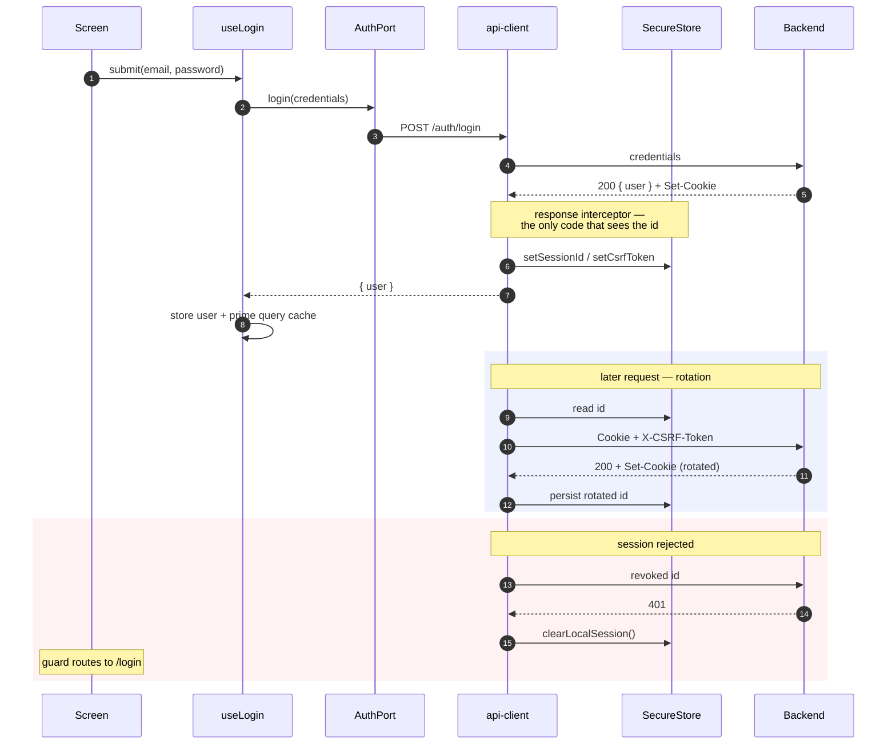

# Authentication

Auth is an **opaque server-side session**, not a JWT. The credential is a random
id the server issues; it carries no claims and cannot be refreshed — when the
server rejects it, the row is gone and the only correct move is to log in again.

- **Storage**: the session id lives in SecureStore — Keychain on iOS,
  Keystore-backed storage on Android — scoped
  `AFTER_FIRST_UNLOCK_THIS_DEVICE_ONLY`, so it never syncs to iCloud or
  transfers to a new device. **Not** AsyncStorage, which is unencrypted files
  readable on a rooted device or out of an unencrypted backup. AsyncStorage
  holds only the non-sensitive profile.
- **Transport**: the id is attached explicitly as a header rather than relying on
  the ambient cookie jar, which is shared app-wide including with WebViews.
- **Rotation**: the response interceptor captures rotated ids from `set-cookie`.
  Missing one means presenting a revoked id on the next call, which the server
  reads as reuse and answers by killing the whole session family.
- **Logout** calls the backend _before_ clearing locally, so the row is actually
  deleted. Clearing only the device would leave the id usable by anyone who
  captured it. It still clears locally if the network call fails.
- **CSRF**: a native app is not CSRF-exposed, but the backend applies one rule to
  every cookie-authenticated caller, so the token is stored beside the session id
  and echoed back when the server has issued one.

## Login, rotation, and expiry

The credential is captured from a header and written to the keystore by the
interceptor — it is never a field in the response body, and never passes through
a hook:

Missing a rotation (step 12) means presenting a revoked id next call, which the
server reads as reuse and answers by killing the whole session family — hence
the dedicated tests in `src/lib/__specs__/api-client.spec.ts`.

Layering: screens → `src/hooks/use-auth.ts` (React Query + Zustand writes) →
`src/adapters` (`getAuthPort()`) → `src/services/auth.ts` (`authApi`) →
`src/lib/api-client.ts` (axios instance).

Everything above describes the **`api` provider**. Hooks reach it through the
provider-agnostic port in `src/adapters/`, so the credential model here — opaque
id, cookie transport, server rotation — is one adapter's implementation, not a
contract the app depends on. See [backend-adapters.md](backend-adapters.md).

`useHydrate` restores the session on launch and `useAuthGuard` keeps the route
and auth state in sync. A stored id only means a session _may_ still be live —
it is opaque, so only the server can confirm it.

Hydration asks the active provider via `getAuthPort().hasSession()` rather than
reading a session id directly. That matters: it once called `getSessionId()`,
which is the REST provider's opaque id, so any provider storing something else —
Supabase's JWT pair — hydrated as signed-out on every launch despite a valid
session. `stores/__specs__/auth.spec.ts` guards against the regression.
