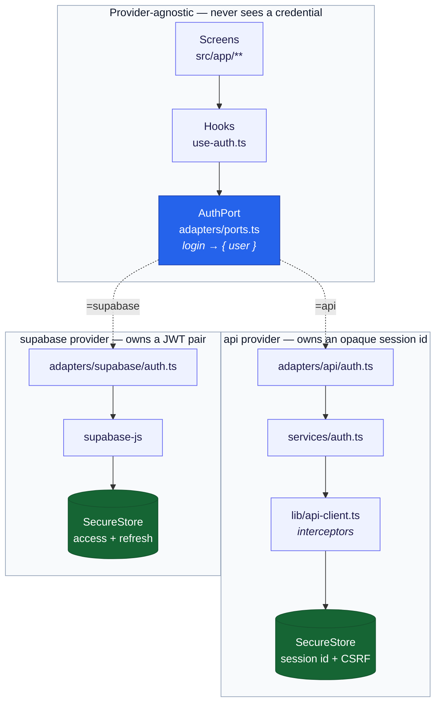

# Backend adapters

The app talks to a backend through a contract, not through a specific provider.
`src/adapters/` holds that seam so the provider can be swapped with a one-line
env change.

## Which architecture is this?

The contracts in `ports.ts` are **driven ports** in the Hexagonal Architecture
sense: the app declares what it needs, an outside actor implements it, and the
dependency arrow points inward. Clean Architecture calls the identical construct
an _output port_, and names its implementations gateways or repositories. Both
are Dependency Inversion applied at an architectural boundary — the structure
here is unchanged under either vocabulary, so read "port" as "the interface the
app owns and the provider satisfies."

What this is **not** is a full Clean Architecture interior. There are no
entities and no use-case interactors. React Query hooks in `src/hooks/` play the
use-case role directly, and framework types — mutations, Zustand stores, Expo
Router navigation — sit immediately above the boundary rather than behind a
further layer.

That is a deliberate trade. React Query already owns caching, retry, and
invalidation; wrapping it in framework-free interactors would mean
reimplementing those semantics to satisfy a layering rule. The inversion is
applied at the one boundary that actually changes — the backend provider — and
nowhere it would only add ceremony. If a domain ever grows orchestration worth
testing without React, that is the moment to introduce an interactor for _that_
domain, not a reason to pre-emptively layer all of them.

## Layout

```
src/adapters/
  ports.ts        # AuthPort — the contract every provider satisfies
  container.ts    # resolves the active provider; the DI seam
  index.ts        # barrel — import from '@/adapters'
  api/            # proprietary REST backend (default)
  supabase/       # supabase-js provider
    auth.ts       #   the AuthPort implementation
    client.ts     #   lazy client + chunked SecureStore adapter
    mappers.ts    #   Supabase user/error → app types
```

## Selecting a provider

```bash
EXPO_PUBLIC_API_PROVIDER="api"       # default — the REST backend
EXPO_PUBLIC_API_PROVIDER="supabase"  # supabase-js
```

An unrecognized value warns and falls back to `api` rather than throwing.
`EXPO_PUBLIC_*` is inlined at build time, so a typo cannot be fixed on a device
that already has the binary — a hard crash on launch would leave no way out,
while a warning plus a working default keeps the app usable and the mistake
visible.

## Using it

Resolve the port at call time:

```ts
import { getAuthPort } from '@/adapters';

const { user } = await getAuthPort().login({ email, password });
```

**Never destructure at module scope.** `const { login } = getAuthPort()` binds
the first provider permanently and silently ignores every later override — the
late binding is the entire point of the indirection.

In tests, install a double and restore afterwards:

```ts
setBackendAdapter(fakeAdapter);
afterEach(() => resetBackendAdapter());
```

## Why the credential is not on the contract

`login` resolves to `{ user }` and nothing more. The two providers authenticate
in fundamentally different ways:

|            | REST backend          | Supabase              |
| ---------- | --------------------- | --------------------- |
| Credential | opaque session id     | JWT + refresh token   |
| Delivery   | `Set-Cookie` header   | response body         |
| Renewal    | rotated by the server | refreshed by the SDK  |
| Revocation | row deleted           | refresh token revoked |

Putting a session on the contract would force hooks and stores to branch on the
shape of a credential they have no business reading. Instead each adapter
persists its own, internally — and nothing above the adapter layer can tell
which provider is live.



The credential exists only inside the lower two boxes. Everything above the port
deals in `User`.

### Where this lives in the code

| Guarantee                         | Code                                                                           |
| --------------------------------- | ------------------------------------------------------------------------------ |
| Contract carries no credential    | `ports.ts` — `login` returns `LoginResponse` (`{ user }`)                      |
| Only credential-adjacent method   | `ports.ts` — `clearSession: () => Promise<void>`, discards without exposing    |
| `api` binds its own clear         | `adapters/api/auth.ts` — `clearSession: clearLocalSession`                     |
| `api` persists the rotated id     | `lib/api-client.ts` — response interceptor calls `setSessionId`/`setCsrfToken` |
| `api` wipes keystore + cookie jar | `lib/api-client.ts` — `clearLocalSession()`                                    |

To verify the boundary holds after a change, grep for credential access above
the adapter layer — it should return nothing:

```bash
grep -rn "getSessionId\|setSessionId\|secure-store" src/hooks src/app src/components
```

`clearSession` is the one credential-adjacent method on the port, because the
401 handler and the logout hooks genuinely need to discard whatever the active
adapter stored without knowing what that is. It resolves rather than rejecting
even on the unimplemented provider: it runs on paths where the caller has
already decided to be signed out, and throwing there would strand the app
holding a credential it has chosen to discard.

### How hydration stays provider-agnostic

`hasSession()` is on the port for this reason. `stores/auth.ts` used to call
`getSessionId()` directly — the REST provider's opaque id — so under Supabase it
always answered `null` and the app hydrated as signed-out on every launch
despite a valid stored token: silent, and looking like a Supabase bug rather
than a layering one.

The store now asks the active provider. `hasSession()` reports that a credential
is _present_, never that it is valid — only the server can say that, which
`me()` does on mount.

## The Supabase provider

Implemented against `@supabase/supabase-js` v2. To use it, set the three
variables and restart:

```bash
EXPO_PUBLIC_API_PROVIDER="supabase"
EXPO_PUBLIC_SUPABASE_URL="https://<project>.supabase.co"
EXPO_PUBLIC_SUPABASE_ANON_KEY="<anon key>"
```

### The client is lazy, and must stay that way

`container.ts` imports **every** provider to build its registry, so anything a
provider does at module load runs on every launch regardless of which one is
selected. `createClient` throws when the URL is missing, so building it eagerly
crashed the app at startup for the default configuration — REST backend, no
Supabase credentials. `getSupabaseClient()` defers construction and reports
which variables are missing if something actually calls it.

Keep new providers side-effect-free at import for the same reason;
`__specs__/container.spec.ts` guards this.

### Tokens live in a chunked SecureStore

Supabase defaults to AsyncStorage — unencrypted files, readable on a rooted
device — but the refresh token is a long-lived credential, so the client is
pointed at SecureStore instead (same reasoning as the REST session id, see
[authentication.md](authentication.md)).

SecureStore rejects values over 2048 bytes and a session carrying custom claims
can exceed that. The failure mode is nasty: the write throws, the session is
never persisted, and the user appears to be logged out at random much later. So
values are split across numbered keys (`sb-session.0`, `.1`, …) with a count
header under the base key. That header is what lets a read know how many parts
to reassemble, and what lets a shrinking value clean up its surplus chunks —
without it, a later read would splice the tail of an old session onto a new one.

A missing chunk or an unparseable header reads as **no value**, never as a
truncated session: re-authenticating is recoverable, handing the SDK half a
credential is not.

### Behavioral differences that are normalized away

The adapter's job is to make Supabase behave like the contract, not to expose
its quirks. Each of these is pinned by a test:

| Concern          | What Supabase does                                   | What the adapter does                                                              |
| ---------------- | ---------------------------------------------------- | ---------------------------------------------------------------------------------- |
| `register`       | Returns a live session when confirmation is disabled | Discards it — the port promises registration does **not** sign the user in         |
| `resetPassword`  | Recovery is session-based, not token-in-body         | Exchanges `token_hash` via `verifyOtp` first, then updates, then drops the session |
| `changePassword` | Does not verify the current password                 | Re-authenticates with `signInWithPassword` before updating                         |
| `me`             | `getSession()` returns the local cache               | Uses `getUser()`, which revalidates server-side                                    |
| Errors           | Rejects with a flat `AuthError.status`               | Reshaped to the axios-like `error.response.status` screens already read            |
| `verifyEmail`    | Wants `token_hash`, not the raw token                | Maps the port's `token` onto `token_hash`                                          |
| `logoutAll`      | `signOut({ scope: 'global' })`                       | Bound to the port's `logoutAll`                                                    |

Deep links are handled in `src/app/auth/[...slug].tsx`, which accepts **both**
`token` (REST) and `token_hash` (Supabase) and normalizes to `token` — reading
only the former silently dropped every Supabase link onto an error state.

### Before production: `role` comes from metadata

`mappers.ts` reads `role` out of `user_metadata`, which is **client-writable**
unless locked down. Unrecognized values fall back to `user` so a tampered value
cannot widen access, but a real deployment should source the role from a
`profiles` table or a custom JWT claim and tighten the metadata policy.

## Adding a domain

Three edits, in order:

1. A port type in `ports.ts` (`BillingPort`, `ProfilePort`, …).
2. A sibling key on `BackendAdapter`.
3. An implementation in **every** provider — the compiler enforces this the
   moment the key is non-optional.

The contract test in `src/adapters/__specs__/ports.spec.ts` runs one suite per
registered adapter, so the new domain is covered for all providers at once. Add
its method names to that spec's method list: the list is written out literally
rather than derived from the type, because types vanish at runtime and a
`keyof` loop would only ever check the keys an adapter already has.

## Deliberately not ported

The pattern earns its place where there is a real second implementation or a
security invariant to hold at a boundary. Elsewhere it is ceremony:

| Thing                             | Port it?                    | Why                                                                                                                                                                                                                                                             |
| --------------------------------- | --------------------------- | --------------------------------------------------------------------------------------------------------------------------------------------------------------------------------------------------------------------------------------------------------------- |
| Zustand stores                    | **No**                      | State lives _inside_ the app, not across a boundary — there is no outward dependency to invert. Swapping to Redux rewrites every selector anyway, and an interface thin enough to hide both erases the ergonomics. Already trivially testable via `setState()`. |
| `expo-router`, i18n, Reanimated   | **No**                      | No second implementation, and none coming.                                                                                                                                                                                                                      |
| SecureStore / AsyncStorage / MMKV | **Eventually, as one port** | See below.                                                                                                                                                                                                                                                      |

### A `StoragePort`, when a second provider needs it

`secure-store.ts` currently exposes `getSessionId`/`setSessionId`/`getCsrfToken`
— an API shaped around the REST provider's credential model. A Supabase adapter
storing an access/refresh pair must either abuse `setSessionId` to hold
something that is not a session id, or reach for `expo-secure-store` directly
and duplicate the keychain options.

The fix is **one port with two named instances**, split by security guarantee
rather than by library:

```ts
type StoragePort = {
  get(key: string): Promise<string | null>;
  set(key: string, value: string): Promise<void>;
  remove(key: string): Promise<void>;
};

// secureStorage → expo-secure-store (Keychain / Keystore)
// deviceStorage → AsyncStorage today, MMKV later
```

Secure-vs-not is the split that matters, because it is a security invariant that
must survive any swap; _which library backs the non-secure half_ is the detail,
and it is exactly the axis MMKV moves along. The port being `Promise`-returning
is what absorbs MMKV's synchronous API instead of letting it ripple into callers.

Note this is a **sharing** problem, not a swapping one — the value is letting
both auth providers store credentials without inventing their own key handling,
not swapping the keychain library. So it needs one interface, not a provider
registry.

**Do this when implementing Supabase or adopting MMKV, not before.** Today
`secure-store.ts` has one consumer and works; the second credential model is
what will reveal the right shape.

## Planned: a billing port

Payments are the natural next domain, and the one where this layer pays for
itself — provider lock-in is expensive and the SDKs agree on almost nothing.
The shape follows `AuthPort`'s rules exactly:

```ts
export type BillingPort = {
  getSubscription: () => Promise<Subscription | null>;
  listPlans: () => Promise<Plan[]>;
  startCheckout: (plan: PlanId) => Promise<CheckoutSession>;
  cancelSubscription: () => Promise<MessageResponse>;
  restorePurchases: () => Promise<Subscription | null>;
};
```

Written in the app's own types — `Subscription`, `Plan` in `src/types/billing.ts`
— never Stripe's `Stripe.Subscription` or RevenueCat's `CustomerInfo`. Same
reasoning as the auth credential: whatever leaks through the contract is what
every caller ends up coupled to.

### Billing is a separate axis from the backend

A Supabase backend with Stripe billing, or the REST backend with RevenueCat, are
both ordinary pairings. If billing varies independently, give it its own
variable and resolve it separately:

```bash
EXPO_PUBLIC_API_PROVIDER="api"
EXPO_PUBLIC_BILLING_PROVIDER="revenuecat"
```

Folding both into one `ProviderName` would force every backend/payment
combination to be enumerated as its own provider — four names for two choices,
and worse as either side grows.

### Two rules for whoever implements it

**Never trust the client for entitlement.** `getSubscription` returns what the
_server_ believes, not what the store SDK reports locally — a jailbroken device
can claim anything. This also keeps providers genuinely interchangeable: store
receipts are not portable between providers, but verified entitlement state is.

**Expect a store SDK, not a card processor.** App Store and Play Store policy
requires their IAP for digital goods, so a native billing adapter is usually
RevenueCat or Expo IAP. Stripe is the right implementation for web checkout or
physical goods — precisely the kind of swap this port exists to absorb.

`restorePurchases` is on the contract for that reason: it has no meaning for a
card processor, but it is a **store requirement** for IAP, and a port that
omitted it would make the compliant provider unimplementable.
